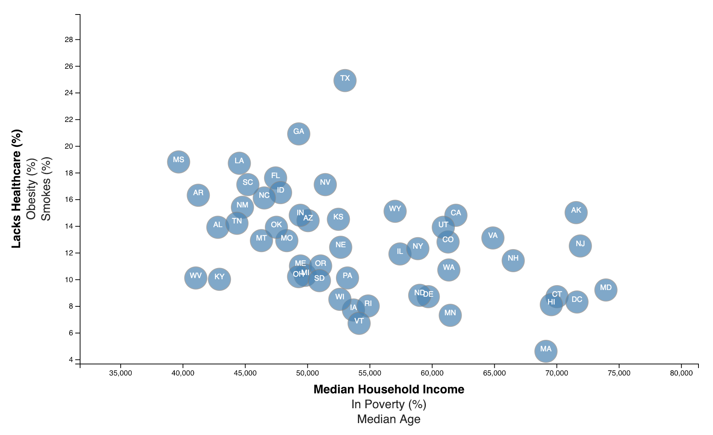
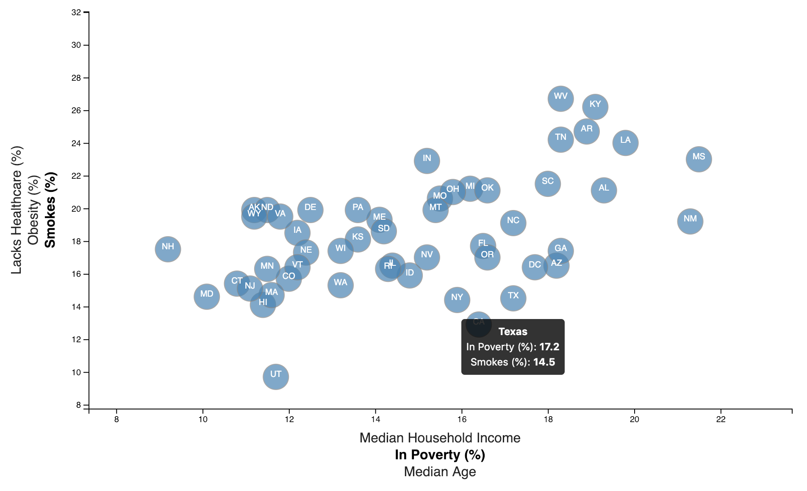
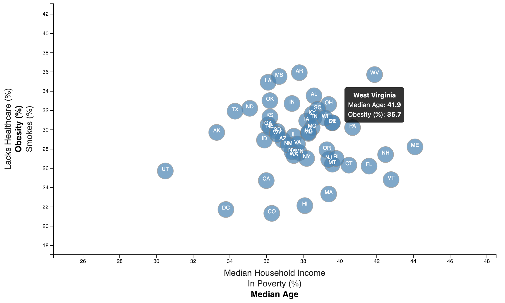

# D3 Times - Data Journalism and D3.js

## Description
Built an interactive data visualization using D3.js. Scatter plots between two data variables were created using data from the [2014 ACS 1-year estimate dataset](https://factfinder.census.gov/faces/nav/jsf/pages/searchresults.xhtml).

## Tools Used
**Python, JavaScript, D3.js**

## Step 01 - Plotly.js
D3.js was used to build the interactive scatter plots that represented each state with circle elements. Additional labels with different variables were added and given click events so that users can decide which data comparisons to display. The transitions are animated by D3.js. 

## Step 02 - D3 Tip

D3 tooltips were added to the circles in order to reveal the specific element's data when the users click on the circles.

## Finished Result

The visualization was deployed to Heroku for live demonstration.

[Heroku App]()

